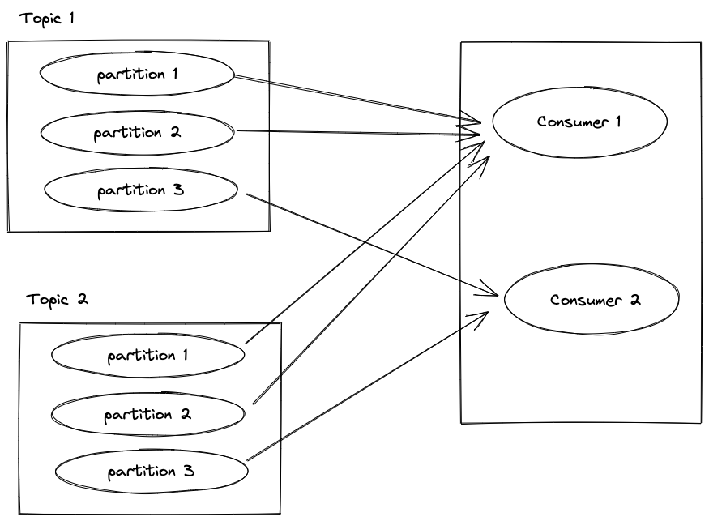
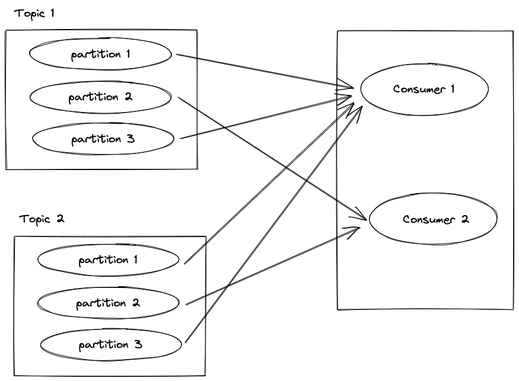
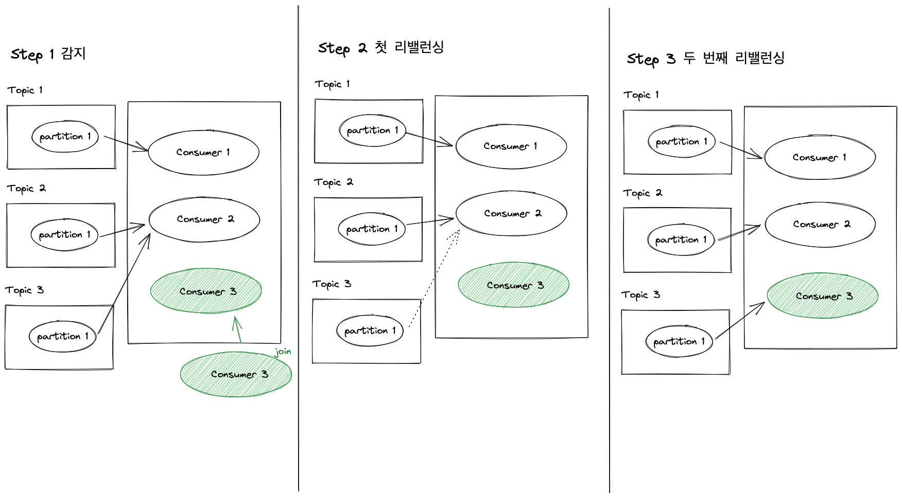

# 컨슈머의 내부 동작원리와 구현 

컨슈머의 기본 역할은 카프카에서 메시지를 가지고 오는 것이다.

여기에서는 더 나아가서 컨슈머 그룹, 오프셋 관리, 컨슈머들의 파티션 할당 정책과 이전 프로듀서에서 정리한 정확히 한 번 전송과 관련해서 컨슈머 처리를 알아보겠다.

## 컨슈머 오프셋 관리

카프카에서는 메시지를 컨슈머가 어디까지 읽었는지를 나타내는 위치를 오프셋 (Offset) 이라고 부른다.

이 오프셋은 숫자 형태로 나타내고 컨슈머 그룹은 자신의 오프셋 정보를 카프카에 있는 토픽 (__consumer_offsets) 에다가 저장한다.

이 토픽별로 각 컨슈머 그룹의 오프셋 정보가 기록된다.

오프셋 기록에 대한 동작을 간단히 설명하자면 컨슈머 그룹에서 컨슈머는 지정된 토픽의 메시지를 읽은 후에 읽어온 위치의 오프셋 정보를 __consumer_offsets 이라는 토픽에 기록한다.

기록할 때는 컨슈머 그룹, 토픽, 파티션 등의 내용을 합쳐서 기록한다.

모든 컨슈머 그룹의 정보가 저장되는 __consumer_offsets 토픽은 다음과 같이 파티션 수와 리플리케이션 팩터 수를 가지고 있고, 내부 토픽이지만 파티션 수와 리플리케이션 수는 브로커 설정 파일인 `[server.properties](http://server.properties)` 에서 설정할 수 있다.

- `offsets.topic.num.partitions` 기본 값은 50이다.
- `offsets.topic.replication.factor` 기본 값은 3 이다.

## 그룹 코디네이터

컨슈머들은 하나의 컨슈머 그룹의 구성원으로 속하며, 컨슈머 그룹 내의 각 컨슈머들은 서로 자신의 정보를 공유하면서 하나의 공동체로 동작한다.

컨슈머 그룹 내의 컨슈머들은 언제든지 자신이 속한 컨슈머 그룹에서 떠날 수 있으며 새로운 컨슈머가 합류할 수도 있다.

따라서 컨슈머 그룹은 이러한 변화를 인지하고 각 컨슈머들에게 균등하게 작업을 분배해야한다.

컨슈머 그룹에서 각 컨슈머들에게 작업을 균등하게 분해하는 동작을 **컨슈머 리밸런싱 (consumer rebalancing)** 이라고 부른다.

이는 컨슈머 그룹에 컨슈머가 변화가 생길 때, 파티션의 숫자가 변화가 생길 때 작업을 어떻게 분배할 지 결정하는 행위다.

컨슈머 그룹은 안전하게 컨슈머 그룹 관리를 위해서 별도의 브로커에 코디네이터가 존재하는데 이를 **그룹 코디네이터 (group coordinator)** 라고 한다.

그룹 코디네이터는 컨슈머 그룹에서 컨슈머가 변경이 생기거나 구독하는 토픽의 파티션에 변경이 생기는 경우 이를 감지하는 역할을 한다.

단순하게만 말하면 컨슈머에서 `bootstrap.brokers` 와 `[group.id](http://group.id)` 만 설정하면 컨슈머 그룹이 구성된다.

컨슈머 그룹은 그룹 코디네이터와 연결되서 관리를 받으며 컨슈머들은 새로 합류하거나 나갈 수도 있다.

이떄 새로 들어오는 컨슈머는 join 요청을 나가는 컨슈머는 leave 요청을 코디네이터에게 보내게 된다.

하지만 만약 leave 요청이 유실되면 어떻게 코디네이터는 이를 감지할까?

컨슈머들의 변경을 감지하기 위해서 그룹 코디네이터와 컨슈머들은 서로 하트비트 (Heartbeat) 를 주고 받는다.

이를 통해 그룹 코디네이터는 컨슈머가 살아 있는지 확인한다.

이런 옵션은 총 세가지가 있는데 하나씩 보자.

- `[heartbeat.interval.ms](http://heartbeat.interval.ms)` : 기본 값은 3000 이며, 그룹 코디네이터와 하트비트 인터벌 시간을 말한다. 해당 시간은 `[session.timeout.ms](http://session.timeout.ms)` 보다 낮아야 하고 1/3 이 적절하다.
- `[session.timeout.ms](http://session.timeout.ms)` : 기본 값은 10000 이다. 그룹 코디네이터가 이 시간안에 하트 비트를 받지 못한다면 문제가 발생했다고 판단해서 컨슈머 그룹에서 해당 컨슈머는 제거되고 리밸런싱이 일어난다.
- `[max.poll.interval.ms](http://max.poll.interval.ms)` : 기본값은 300000 이다. 컨슈머는 주기적으로 poll() 메소드를 통해 토픽에서 레코드를 가지고 오는데 poll() 호출 후 최대 5 분간 poll() 요청이 없다면 컨슈머가 문제가 있다고 판단해 리밸런싱이 일어난다.

컨슈머의 상태는 컨슈머가 살아 있는지를 단순하게 하트비트만으로 확인하는게 아니라 정상적으로 동작을 하는지까지 검사하고 있다. (이중으로 검사하고 있다.)

## 스태틱 멤버십

때로는 하드웨어 점검이나 소프트웨어 업데이트 등의 이유로 관리자는 컨슈머 그룹 내의 컨슈머들을 하나씩 순차적으로 재시작하고 싶은 경우가 있다. 하지만 하트비트 주기, 세션 타임아웃 등의 설정으로 인해 하나의 컨슈머가 재시작 할 때마다 전체 리밸런싱이 일어난다.

리밸런싱이 일어나는 동안에 컨슈머들은 일시 중지되므로 이는 매우 불편하다.

컨슈머 그룹에 소수의 컨슈머만 있다면 리밸런싱은 몇번 일어나지 않지만 10 개의 컨슈머가 있다면 최소 10 번의 리밸런싱이 일어나는 것이다.

- 일반적으로 컨슈머들을 식별하기 위해 엔터티 ID 를 임시로 할당 받는데 컨슈머가 재시작되면 컨슈머는 새로운 엔터티 ID 를 받고 리밸런싱이 된다.

이렇게 컨슈머 그룹에서 리밸런싱으로 상당한 시간이 소요될 수 있으니까 카프카 2.3 버전 부터는 스태틱 멤버십 (static membership) 이라는 개념을 도입했다.

스태틱 멤버십을 통해 컨슈머 그룹 내에서 컨슈머가 재시작 하더라도 리밸런싱이 얼아나지 않도록 한다.

즉 컨슈머가 인식할 수 있는 ID 를 적용해서 나갔다가 다시 합류하더라도 그룹 코디네이터가 기존 구성원임을 인식할 수 있도록 해준다.

이는 컨슈머가 잠시 나갔다오더라도 그룹 코디네이터에게 알림을 안가도록 해서 리밸런싱을 피하는 방법이다.

스태틱 멤버십을 사용하기 위한 옵션은 의외로 간단하다. `[group.instance.id](http://group.instance.id)` 의 기본 값이 null 인 String 타입인 이 값만 설정하면 된다.

이 값에는 그룹 코디네이터가 컨슈머를 식별하기 위해 컨슈머 인스턴스 별로 고유한 값을 입력하면 된다.

예를 들어 접두어로 consumer 를 쓰고 접미어로 호스트 네임이나 서버 IP 를 활용하면 된다.

`consumer-hostname1` , `consumer-hostname2` 이런 식으로.

스태틱 멤버십을 적용할거라면 `[session.timeout.ms](http://session.timeout.ms)` 시간은 조금 더 길게 설정하자.  결국 이 시간안에 하트비트를 그룹 코디네이터에게 전달하지 못하면 리밸런싱이 일어나기 떄문에.

## 컨슈머 파티셔너 할당 전략

프로듀서에서 파티셔너라는 기능이 있었다.

이는 레코드를 토픽의 파티션으로 전송하는데 사용하는 전략이었다.

컨슈머도 이와 유사하게 토픽의 어느 파티션으로부터 레코드를 읽어올 지 결정할 수 있다.

컨슈머 그룹의 리더 컨슈머가 정해진 파티션 할당 전략에 따라 각 컨슈머와 대상 토픽의 파티션을 매칭시킨다.

파티션 할당 전략은 컨슈머 옵션의 `partition.assignment.strategy` 로 표시하며 다음과 같은 갑들이 있다.

- `RangeAssignor` (레인지 전략)
- `RoundRobinAssignor` (라운드 로빈 전략)
- `StickyAssignor` (스티키 전략)
- `CooperativeStickAssignor` (협력적 스티키 전략)

### 레인지 파티션 할당 전략

레인지 파티션 할당 전략은 기본값으로서 각 토픽별로 할당 전략을 사용하게 된다.

먼저 구독하는 토픽에 대한 파티션을 순서대로 나열한 후 컨슈머도 순서대로 정렬한다.

그 다음 컨슈머 당 토픽별로 파티션을 몇 개 할당 받아야 하는지를 전체 파티션 수 / 컨슈머 수 로 나눈다.

컨슈머 수와 파티션 수가 일치하면 균등하게 할당되지만 그렇지 않다면 앞쪽의 컨슈머들이 추가로 더 많이 받게 된다.

다음의 토픽과 컨슈머 그룹의 경우 두 개의 컨슈머가 있고 하나의 토픽에 파티션 수가 3 개씩 있으므로 3 / 2 를 계산한다.



이때 딱 나눠 떨어지지 않으므로 앞쪽의 컨슈머가 더 많은 파티션을 할당받게 된다.


### 라운드 로빈 파티션 할당 전략

라운드 로빈 파티션 할당 전략은 간단하다.

먼저 컨슘해야 하는 파티션과 컨슈머 그룹 내 컨슈머를 모두 나열한 후 파티션을 컨슈머 별로 라운드 로빈하면 된다.

즉 다음과 같을 것이다.



### 스티키 파티션 할당 전략

스티키 파티션 할당 전략은 컨슈머 그룹에서 리밸런싱이 일어나더라도 최대한 기존의 컨슈머와 파티션 매핑을 유지하려고 하는 전략이다.

스티키 파티션 할당 전략은 두 가지 목적으로 컨슈머에 파티션을 할당한다.

첫 번째 목적은 가능한 균형 잡힌 파티션 할당이고, 두 번째 목적은 재할당이 발생할 때 되도록 기존의 할당된 파티션 정보를 보장하는 것이다.

따라서 스티키 파티션 할당 전략이라고 해서 무조건 기존의 파티션과 컨슈머를 유지하지 않느다.

스티키 파티션 할당 전략에서 최초의 배치 전략은 라운드 로빈이다.

두 번째 전략은 리밸런싱이 일어나기 전 매핑을 그대로 유지하면서 다음 규칙이 추가된다.

- 컨슈머들의 최대 할당된 파티션 수의 차이는 1
- 기존에 존재하는 파티션 할당은 최대한 유지한다.
- 재할당 동작 시 유효하지 않은 모든 파티션 할당은 제거한다.
- 할당하지 않은 파티션들은 군형을 맞추는 방법으로 컨슈머들에게 할당된다.

### 협력적 스티키 파티션 할당 전략

협력적 스티키 파티션 할당 전략은 스티키 전력과 결과적으로는 동일하다.

다만 한 가지 차이점이 있는데, 바로 컨슈머 그룹 내부의 리밸런싱 동작이 한층 더 고도화 되었다느 ㄴ것이다.

지금까지의 컨슈머 리밸런싱 동작에는 내부적으로 EAGER 라는 리밸런스 프로토콜을 사용했고, EAGER 프로토콜은 컨슈머 리밸런싱 동작 시 컨슈머에 할당된 모든 파티션을 항상 취소했다.

이렇게 리밸런싱 동작에서 모든 파티션을 항상 취소하는 이유로는 다음과 같다.

- 컨슈머들의 파티션 소유권 변경 때문이다. 파티션의 소유권을 넘기려면 소유권을 해제해야 넘길 수 있다.
- 그룹 내에서 여러 파티션들에 대해 소유권 변경 작업이 동시에 이루기 위해선 이게 구현이 간단하다.

하지만 스티키 파티션 할당 전략은 리밸런싱시에 컨슈머들의 다운 타임이 길다는 문제가 있다.

즉 감지 → 중지 → 재시작 단계에서 중지 단계가 생긴다는 점이다.

이 중지 단계에서는 파티션과 컨슈머의 사이는 끊겨있다.

이러한 이류로 카프카 2.3 버전에서는 카프카 커넥트에 새로운 협력적 스티키 파티션 할당 전략이 적용되었고

아파치 카프카 2.4 버전 부터는 컨슈머 클라이언트에도 적용이 되었다.

협력적 스티키 파티션 할당 전략은 내부 리밸런싱 프로토콜인 EAGER 가 아닌 COOPERATIVE 프로토콜을 적용했고 이 프로토콜은 리밸런싱이 동작하기 전의 컨슈머 상태를 유지할 수 있게 헀다.

COOPERATIVE 프로토콜은 동작 중인 컨슈머들에게 영향을 주지 않는 상태에서 몇 차례에 걸쳐서 리밸런싱이 일어난다.



진행 순서는 다음과 같다.

1. 컨슈머 그룹에 새로운 컨슈머가 합류하면서 리밸런싱이 진행된다.
2. 컨슈머 그룹 내 컨슈머들은 그룹 합류 요청과 자신들이 컨슘하는 토픽의 파티션 정보를 그룹 코디네이터에게 전송한다.
3. 그룹 코디네이터는 해당 정보를 조합해서 컨슈머 그룹의 리더에게 전송한다. (여기까지가 Step 1 이다.)
4. 컨슈머 그룹의 리더는 현재 컨슈머들이 소유한 파티션 정보를 활용해서 제외해야 할 파티션 정보를 만들어서 컨슈머 그룹 내 멤버들에게 전송한다.
5. 새로운 파티션 정보를 받은 컨슈머 그룹 멤버들은 현재의 파티션 할당 전략과 차이를 보고 필요 없는 파티션들은 제외한다. (여기까지가 Step 2 이다.)
6. 제외된 파티션 할당을 위해 컨슈머들은 다시 합류 요청을 한다. 여기서 두 번째 리밸런싱이 트리거 된다.
7. 컨슈머 그룹의 리더는 데외된 파티션을 적절한 컨슈머에게 할당한다.

협력적 스티키 전략은 카프카 2.4 에서 처음 공개되서 2.5 에서는 안정화 되었다.

EAGER 작업과 COOPERATIVE 프로토콜의 성능 비교 작업은 다음 블로그에서 볼 수 있다. 아마 3.0 카프카 에서는 협력적 스티키 전략을 기본으로 가지고 갈 것 같다.

- [https://www.confluent.io/blog/incremental-cooperative-rebalancing-in-kafka/](https://www.confluent.io/blog/incremental-cooperative-rebalancing-in-kafka/)

## 정확히 한 번 컨슈머 동작

이전의 트랜잭션 코디네이터는 프로듀서의 정확히 한 번 전송이 성공하면 해당 레코드의 트랜잭션 성공을 표시하는 특수한 메시지를 추가한다.

따라서 컨슈머는 트랜잭션 코디네이터가 특수한 메시지를 표시한 레코드만 읽는다면 정확히 한 번 읽을 수 있다.

컨슈머 쪽에서는 다음과 같은 설정만 추가하면 된다.

```java
Properties props = new Properties();
props.setProperty(ConsumerConfig.ISOLATION_LEVEL_CONFIG, "read_comitted"); 
```

이 옵션을 설정하면 트랜잭션이 완료된 메시지만 읽을 수 있게 된다.

많은 사람들이 오해하는 것 중에 트랜잭션 컨슈머라고 해서 정확히 한 번만 가져오는 것은 아니다.

프로듀서의 경우 트랜잭션 코디네이터와 통신하면서 해당 트랜잭션이 정확하게 처리되는 것을 보장했지만 컨슈머의 경우는 트랜잭션 프로듀서가 보낸 메시지만 가져올 수 있다는 걸로 옵션으로 선택한 것밖에 없다.

컨슈머는 트랜잭션 코디네이터와 통신하는 부분이 없으므로 정확하게 메시지를 한 번 가지고 온다는 보장은 없다.’’