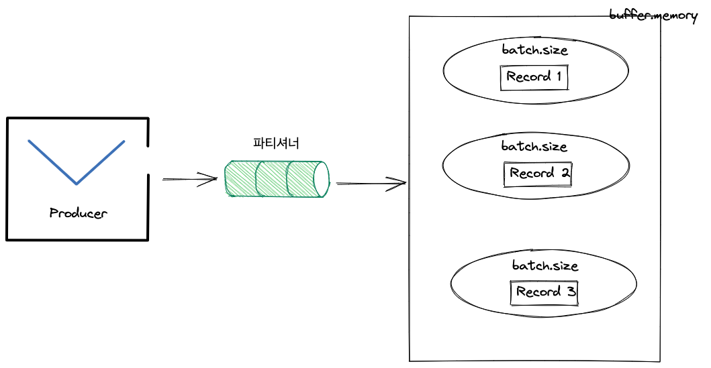

# 프로듀서의 내부 동작 원리와 구현 

## 프로듀서의 주요 설정들

## 파티셔너

카프카의 토픽은 성능 향상을 위해서 병렬 처리가 가능한 파티션으로 나뉜다.

그리고 프로듀서가 카프카로 전송한 메시지는 해당 토픽 내 각 파티션의 로그 세그먼트에 저장된다.

이때 프로듀서는 어떤 파티션으로 보낼지 결정해야 하는데 이것이 파티셔너이다.

프로듀서가 파티션을 결정하는 알고리즘은 기본적으로 메시지의 키를 해시 처리해서 파티션을 구하는 방식이다. 따라서 키가 같다면 해당 메시지들은 모두 같은 파티션으로 보내진다.

만약 여기서 파티션을 늘리면 어떻게 될까? 카프카에서 처리량을 높이기 위해서 파티션을 늘리는 경우가 때때로 생긴다.

이 경우 메시지의 키와 매핑된 해시 테이블도 변경되므로 파티션을 늘린 후라면 같은 메시지를 보내더라도 다른 파티션으로 전송될 수 도 있다.

### 라운드 로빈 전략

프로듀서 메시지 중 레코드의 키 값은 반드시 필요한 게 아니다. 그러므로 관리자는 레코드의 키 값을 지정하지 않고 메시지를 전송할 수도 있다.

이 경우 키 값은 null 이 되고 기본적으로 라운드 로빈을 통해서 레코드들을 전송한다.

파티셔너를 거친 후 레코드들은 배치 처리를 하기 위해서 프로듀서의 버퍼 메모리에 잠시 대기한 후 카프카로 전송된다.

하지만 이 라운드 로빈 전략은 효율을 떨어뜨릴 수 있다.

왜냐하면 파티셔너에서 카프카로 전송을 할 때 기본적으로 배치 형식으로 보낸다.

그러므로 최소한의 레코드 수의 기준을 충족해야지 카프카에게 전송을 하는데 라운드 로빈 전략을 쓰면 배치를 위한 최소한의 레코드 개수를 맞추는데서 비효율이 발생한다.

예시로 보자.

파티션이 3 개가 있고 배치 전송을 위해 최소 레코드 수도 3 개이다.

여기서 레코드는 1 ~ 5 까지가 들어온다.

그러면 이렇게 할당 될 것이다.

- 파티션 1: 레코드 1, 레코드 4
- 파티션 2: 레코드 2, 레코드 5
- 파티션 3: 레코드 3

이렇게 되면 레코드가 아직 다 채워지지 않았기 때문에 전송이 안된다. 그러므로 프로듀서 옵션인 전송을 위해 기다리는 최대 시간이 지나야지 자동적으로 전송이 될 것이다.

카프카에선 이런 비효율적인 전송을 보완하기 위해서 스티키 파티셔닝 (Sticky Partitioning) 전략을 제공했다.

### 스티키 파티셔닝 전략

스티커 파티셔닝 전략은 카프카 2.4 버전부터 사용할 수 있다.

이 전략은 카프카로 전송하기 위해서 파티션에 필요한 최소 레코드 수를 먼저 채우도록 배치하는 전략이다.

위의 예제 그대로 이용하면 이렇게 될 것이다.

- 파티션 1: 레코드 1, 레코드 2, 레코드 3
- 파티션 2: 레코드 4, 레코드 5
- 파티션 3: 없음

## 프로듀서 배치

카프카에서는 토픽의 처리량을 높이기 위해서 토픽을 파티션별로 나눌 수 있고 프로듀서에서 카프카로 전송할 땐 배치 전송을 권장한다.

프로듀서는 배치 전송을 위해서 다음과 같은 옵션들을 제공해준다.

그림과 같이 보자.



- `buffer.memory` : 카프카로 메시지들을 전송하기 위해 잠시 담아두는 프로듀서의 버퍼 메모리 옵션이다. 기본 값으로 32 MB 로 설정되어 있고 필요에 따라 값을 조정할 수 있다.
- `batch.size` : 배치 전송을 위해 메시지들을 묶는 단위이다. 기본 값은 16 KB 로 되어 있고 설정에 따라 너 높이거나 줄일 수 있다.
- `[linger.ms](http://linger.ms)` : 배치 전송을 위해 버퍼 메모리에서 대기할 수 있는 최대 대기시간을 설정하는 옵션이다. 단위는 밀리초 (ms) 이며 기본 값은 0 이다. 즉 배치 전송을 위해 기다리지 않고 메시지들이 즉시 전송된다.

이런 설정들을 하면 처리량을 높일 수 있을 것이다.

하지만 우리가 만들려는 카프카가 처리량을 높이는게 목표인지, 지연시간이 없도록 하는게 목표인지를 생각해보자.

여기서 중요한 기본적인 사실은 `buffer.memory` 는 반드시 `batch.size` 보다 커야 한다는 것이다.

## 중복 없는 전송

카프카는 사용자들에게 개발 편의성을 높이기 위해서 중복 없는 전송 기능을 제공한다.

먼저 메시지 시스템에서의 전송 방식을 보자.

메시지 시스템에서 메시지 전송 방식은 다음과 같다.

- 적어도 한 번 전송 (at-least-once)
- 최대 한 번 전송 (at-most-once)
- 정확히 한 번 전송 (exactly-once)

적어도 한 번 전송은 프로듀서가 브로커에게 메시지를 보냈는데 브로커가 잘 받았다는 응답 메시지인 ACK 가 네트워크 상에서 유실되서 프로듀서가 한 번 더 보내는 상황이다.

즉 **적어도 한번 전송은** **메시지의 중복이 발생할 수 있다.**

최대 한 번 전송은 프로듀서에서 브로커에게 메시지를 보내고 잘 받았다는 응답을 받지 않는다는 것이다. 그러므로 브로커가 잘 받을수도 있고 아예 안받을 수도 있다.

즉 **최대 한 번 전송**은 **메시지의 유실이 발생할 수 있다.**

메시지 시스템에서 중복 없는 전송을 하기 위해서는 그럼 어떻게 해야할까?

카프카에서는 메시지 헤더에 PID (Producer-ID) 와 메시지 번호 (Sequence Number) 를 보내도록 해서 메시지의 중복을 처리해나간다.

브로커에서는 메시지 헤더에 저장된 PID 와 메시지 번호를 저장해놓고 똑같은 것이 온다면 버리도록 한다. 이를 통해 적어도 한 번 이상 메시지를 전송하더라고 문제가 없다.

그리고 이런 PID 와 시퀀스 번호는 브로커의 메모리에 저장되고 또 리플리케이션 로그에도 저장되므로 브로커가 장애나서 리더가 변경되더라도 문제 없이 중복 없는 메시지 전송이 가능하다.

물론 이렇게 중복 없는 전송을 위해서는 메시지의 헤더에 있는 값을 꺼내서 비교하는 작업이 필요하다.

즉 추가적인 오버헤드가 있다.

하지만 그렇게 비싼 편은 아니다. 컨플루언트 블로그 글을 보면 성능의 20% 정도 감소한다고 한다. 이 작업을 통해서.

- [https://www.confluent.io/blog/exactly-once-semantics-are-possible-heres-how-apache-kafka-does-it/](https://www.confluent.io/blog/exactly-once-semantics-are-possible-heres-how-apache-kafka-does-it/)

중복 없는 전송을 하기 위해서 프로듀서에서는 설정 값을 다음과 같이 변경하면 된다.

- `enable.idempotence` : 프로듀서가 중복 없는 전송을 허용할지 결정하는 옵션이다. 기본값은 false 이고 이 값을 true 로 변경한 후 아래의 설정들도 변경해야 한다. 그렇지 않으면 `ConfigException` 이 발생한다.
- `max.in.flight.requests.per.connection` : 이 값을 `1 ~ 5` 사이의 값으로 설정해야 한다. 이 값은 ACK 를 받지 않는 상태에서 하나의 커넥션에서 보낼 수 있는 최대 요청 수 이다. 기본 값은 5이고 5 이하로 내려야 한다.
- `acks` : 이 값은 `all` 로 설정해야 한다. 그래야 브로커가 장애가 나서 리더가 교체되도 이어서 중복 없는 전송이 가능하다.
- `retries` : ACK 를 받지 않는 경우 재전송을 해야하므로 0 보다 큰 값을 해야한다.


## 정확히 한 번 전송

중복없는 전송을 알았는 데 이게 무슨 소리인가 싶을 수 있다.

정확히 한 번 전송은 트랜잭션과 같은 전체적인 프로세스 처리를 의미하며 중복 없는 전송은 정확히 한 번 전송의 일부 기능이다.

### 디자인

프로듀서가 카프카로 정확히 한 번 메시지를 전송한다는 건 프로듀서가 보낸 메시지들은 atomic 하다는 뜻이다.

즉 전송에 성공하거나 실패하거나 둘 중 하나만 된다는 뜻이다.

이런 프로듀서의 전송을 위해서는 카프카에 컨슈머 그룹 코디네이터가 있는 것과 같이 트랜잭션 코디네이터라는게 내부적으로 있다.

이 트랜잭션 코디네이터는 프로듕서에 의해 전송된 메시지들을 관리한다. 커밋 또는 중단 등을 표시하며.

카프카에서는 컨슈머 오프셋 관리를 위해 오프셋 정보를 내부 토픽에다가 저장하는데 트랜잭션도 동일하게 트랜잭션 로그를 카프카 내부 토픽인 ***transaction_state*** 에 저장한다.

이 역시 토픽이므로 파티션 수와 리플리케이션 팩터 수가 존재하고 브로커의 설정을 통핵 관리자사 설정할 수 있다.

기본값은 다음과 같다.

- `transaction.state.log.num.partitions=50`
- `transaction.state.log.replication.factor=3`

이건 프로듀서가 직접 기록하는게 아니라 트랜잭션 코디네이터가 직접 기록한다는 사실을 알아두자.

정확히 한 번 전송을 이용해서 메시지들이 카프카에 저장되면 카프카의 메시지를 다루는 클라이언트들은 해당 메시지들이 정상적으로 커밋된 건지 실패한 건지 식별할 수 있다.

카프카에서는 이를 식별하기 위한 정보로서, **컨트롤 메시지** 라고 불리는특별한 타입의 메시지가 사용된다.

컨트롤 메시지는 페이로드에 에플리케이션 데이터를 포함하지 않고 애플리케이션들에게 노출되지 않는다.

오로지 브로커와 클라이언트 통신에서만 사용된다.

### 프로듀서 예제 코드

```java
public class ExactlyOnceProducer {
	public static void main(String[] args) {
		String bootstrapServers = "perter-kafka01.foo.bar:9092"; 

		Properties props = new Properties(); 
		props.setProperty(ProducerConfig.BOOTSTRAP_SERVERS_CONFIG, bootstrapServers);
		props.setProperty(ProducerConfig.KEY_SERIALIZER_CLASS_CONFIG, StringSerializer.class.getName());
		props.setProperty(ProducerConfig.VALUE_SERIALIZER_CLASS_CONFIG, StringSerializer.class.getName());	

		// (1) 
		props.setProperty(ProducerConfig.ENABLE_IDEMPOTENCE_CONFIG, "true");
		props.setProperty(ProducerConfig.ACKS_CONFIG, "all"); 
		props.setProperty(ProducerConfig.MAX_IN_FLIGHT_REQUESTS_PER_CONNECTION, "5"); 
		props.setProperty(ProducerConfig.RETRIES_CONFIG, "5")
		props.setProperty(ProducerConfig.TRANSACTION_ID_CONFIG, "perter-transaction-01");

		Producer<String,String producer = new KafkaProducer<>(props); 

		// (2)
		producer.initTransaction(); 

		// (3)
		producer.beginTransaction(); 

		try {
			for (int i=0;i<l;i++) {
				ProducerRecord<String,String> record = new ProducerRecord<>("perter-test-05","TestMessage"); 
				producer.send(record);
				producer.flush();
			}
		} catch (Exception e) {
				// (4) 
				producer.abortTransaction();
				e.printStackTrace();
		} finally {
			// (5) 
			producer.commitTransaction();
			producer.close(); 
		}
	}
}
```

- (1) 은 정확히 한 번 보내기 위한 설정이다.
- (2) 는 프로듀서에서 트랜잭션을 시작하기 위한 초기화 과정이다.
- (3) 은 프로듀서 트랜잭션을 시작한다.
- (4) 는 프로듀서 트랜잭션을 중단한다.
- (5) 는 프로듀서 트랜잭션을 커밋한다.

여기서 설정을 보면 정확히 한 번 전송은 중복 없는 전송에서 하나의 설정이 더 추가되었다.

바로 `TRANSACTIONAL_ID_CONFIG` 이다.

이 옵션은 실행하는 프로듀서 프로세스마다 고유한 아이디로 설정을 해야한다.

즉 두 개의 프로듀서가 있다면 서로 다른 아이디로 설정해야 한다.

### 단계별 동작

자 그럼이 이제 어떻게 동작하는지 보자.

정확히 한 번 전송을 위해서는 트랜잭션 API 를 이용한다.

따라서 가장 먼저 수행하는 작업은 트랜잭션 코디네이터를 찾아야 한다.

프로듀서는 브로커에게 `FindCoordinatorRequest` 를 보내서 트랜잭션 코디네이터의 위치를 찾는다.

컨슈머 코디네이터와 유사한 역할을 하는 트랜잭션 코디네이터는 브로커에 위치한다.

트랜잭션 코디네이터의 여기서의 역할은 PID 와 [Transactional.id](http://Transaction.id) 를 매핑하고 해당 트랜잭션 전체를 관리하는 것이다.

`__transaction_state` 토픽의 파티션 [transactional.id](http://transaction.id) 를 기반으로 해시해서 결정된다. 그리고 이 파티션의 리더가 있는 브로커가 트랜잭션 코디네이터의 브로커로 최종 선정 된다.

이는 [transactional.id](http://transactional.id)  가 정확히 하나의 코디네이터만 갖고 있다는 의미와도 같다.

다음은 프로듀서 초기화 동작이다.

프로듀서는 initTransactions() 를 호출해서 트랜잭션 정송을 위한 `InitPidRequest` 를 트랜잭션 코디네이터로 보낸다.

그러면 트랜잭션 코디네이터는 TID, PID 를 매핑하고 해당 정보를 트랜잭션 로그에 기록한다.

그런 다음 PID epoch 가 한 단계 올라가게 되고 이전의 동일한 PID 와 이전 에포크에 대한 쓰기 요청은 무시된다.

에포크를 활용하는 이유는 신뢰성 있는 메시지 전송을 위함이다.

이제 트랜잭션 시작 동작이다.

그 다음 프로듀서는 beginTransaction() 메소드를 이용해서 새로운 트랜잭션 시작을 알린다.

다음은 트랜잭션 상태 추가 동작이다.

프로듀서가 토픽 파티션 정보를 전달하면 트랜잭션 코디네이터는 해당 정보를 트랜잭션 로그에 기록한다.

TID 와 P0 (파티션 정보) 정보는 트랜잭션 로그에 기록되며 트랜잭션의 현재 상태는 Ongoing 으로 표시된다.

다음으로 메시지를 전송하는데 이 단계에서 프로듀서는 토픽의 파티션으로 메시지를 전송한다.

해당 메시지에는 PID, 에포크, 시퀀스 번호가 함께 포함되서 전송한다.

그 다음으로는 트랜잭션 종료 요청 동작이다.

메시지 전송을 완료한 프로듀서는 commitTransaction() 또는 abortTransaction() 메소드 중 하나를 호출해야 한다.

해당 메소드의 호출을 통해 트랜잭션이 완료되었는지를 코디네이터에게 알린다.

트랜잭션 코디네이터는 두 단계의 커밋 과정을 시작하게 되며, 첫 번째 단계로 트랜잭션 로그에 해당 트랜잭션에 대한 PrepareCommit 또는 PrepareAbort 이다.

다음은 트랜잭션 로그에 기록된 토픽의 파티션에 트랜잭션 커밋 표시를 기록한다. 여기서 기록하는 메시지가 바로 컨트롤 메시지이다.

이 메시지는 해당 PID 의 메시지가 제대로 전송되었는지 여부를 컨슈머에게 나타내는 용도로 사용되고 따라서 트랜잭션 커밋이 끝나지 않은 메시지는 컨슈머에게 반환되지 않는다.

마지막 단계는 트랜잭션 완료로 트랜잭션 코디네이터는 Committed 라고 트랜잭션 로그에 기록한다.

트랜잭션을 이용한 컨슈머는 read_committed 설정을 하면 트랜잭션에 성공한 메시지들만 읽을 수 있다.
