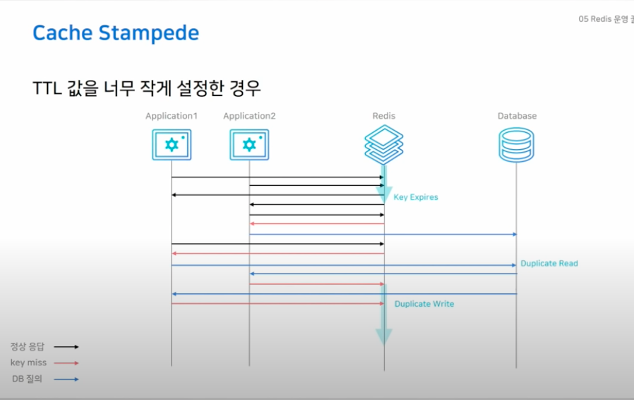

# Redis 야무지게 사용하기 

https://www.youtube.com/watch?v=92NizoBL4uA&t=603s

***

## Redis 캐시로 사용하기

- Redis 를 캐시로 사용한다는 건 데이터의 접근 방법과 데이터의 유형에 따라서 다르다.
- Look Aside 전략 (= 읽기 전략) 
  - 캐시에서 먼저 읽고 없다면 데이터베이스에서 읽는 것.
  - 이 전략에서 중요한 건 캐시가 다운되었을 때 캐시에 붙은 커넥션이 모두 DB 로 이동할 수 있다는 것. 
  - 그리고 초기에 캐시가 없는 상태에서 cache-miss 가 많이 발생하면 성능이 떨어질 수 있기 때문에 DB 에 있는 데이터를 캐시로 이동시키는 cache-warming 작업이 필요하다.
- Write Around 전략 (= 쓰기 전략)

  - 일단 모든 데이터는 DB 에 저장하고 캐시 미스가 발생한 경우에만 캐시로 끌어올리는 것.
- Write Through 전략 (= 쓰기 전략)
  - DB 에 쓰기 전에 캐시에 먼저 쓰는 것.
  - 이 경우에는 리소스 낭비가 생길 수 있기 떄문에 단기간만 쓰겠다는 expire time 을 설정해주는 것이 좋다. 

## Redis 데이터 타입 야무지게 사용하기 

- Redis 의 자료구조를 적절한 곳에 써보자는 취지.
- 데이터 타입은 다음과 같다. 
  - Strings
    - ex) "i am strings"
  - Bitmaps
    - ex) 100101010101
    - String 의 변형. bit 단위로 계산이 가능.
  - Lists
    - ex) [A -> B -> C -> D]
    - 데이터를 순서대로 저장하는 List 는 큐로 사용하기 적절.
  - Hashes
    - ex) { "name": "Jason", "age": "27" }
    - 하나의 키 안에 또다시 여러개의 field-value 를 넣기 위한 데이터 구조.
  - Sets
    - ex) {A, B, C, D}
    - 중복되지 않는 문자열의 집합
  - Sorted Sets
    - ex) { "LG": 1, "KT": 2, "SSG": 3, "NC": 4}
    - Set 과 같다. 그리고 Score 기반으로 정렬을 해준다.
  - HyperLogLogs
    - ex) 00110101 11001110 10101010
    - 주 사용 용도는 하루 방문자 수, 하루 검색 쿼리 수와 같은 것들에 사용한다. 
    - Unique Item Count 를 위한 기능이라고도 함. 
      - 방문자 수를 위해서 모든 방문자 데이터를 기록하고 있다면 시간 비용, 메모리 비용이 많이 든다. HyperLogLogs 를 이용하면 unique 아이템이 들어오는 경우에만 데이터가 증가할 수 있다는듯.
    - 집합의 원소 개수를 추정하는 기능이라고도 불림. 대신 오차가 있을 수 있고, 이 값은 1% 이하임. 장점으로는 유니크한 원소 개수를 추정하는데 적은 메모리를 씀. 
  - Streams
    - ex) { "ID": "1538319053569-0", { "f1": "v1", "f2": "v2"}}
    - 로그 데이터를 처리하기 위해서 들어온 데이터 타입. 
    - 기계들이 주로 생산하는 대규모 데이터를 저장하기 위한 것. 그리고 데이터가 수정되고 삭제되지 않고 추가만 되는 경우. 
    - 주로 온도, 습도, 압력, 진동, 기울기, 밝기 등에 사용. 
    - 초 단위의 데이터를 계속해서 저장하기 위한 것. 
    - Stream 에서는 id 값이라는 게 있는데 이건 <millisecondsTime>-<sequenceNumber> 로 이뤄진다. 같은 ms 에서 들어오는 데이터가 있을 수 있기 떄문에 sequenceNumber 를 쓰고, 이 값은 8 바이트이기 때문에 중복이 생길 수 없다. 

### Use Case - Best Practice 

#### Counting 상황 

- String 을 이용하는 방법 
  - Redis 에서 하나의 키를 쓰고 카운팅 하는 상황마다 증가시키는 방법이 있다.
  - INCR 와 관련된 키워드를 쓰면 쉽게 가능하다.

- Bit 연산을 이용하는 방법
- bit 를 통해서 수를 표현할 수 있기 떄문에 메모리 효율적 

- HyperLogLogs 를 이용하는 방법 
- 오차가 있을 수 있음. 대량의 데이터에 적합하다. 12KB 로 고정된다.
- 유니크하게 구별도 가능 

#### Messaging 상황 

- Lists 를 이용하는 방법 
  - Blocking 기능을 이용해 Event Queue 에 사용이 가능하다. 적절히 이용한다면 Poling Process 를 막을 수도 있다.
    - LPOP 에 Blocking version 으로 주어진 리스트에 값이 없다면 가져올 때까지 블로킹된다.
  - LPUSHX 나 RPUSHX 와 같은 기능을 이용하면 키가 있을 때만 리스트에 데이터를 추가하는게 가능하다. 
    - 이 기능을 이용하는 사례로 트위터의 타임라인이 있다. 트위터를 자주 이용하는 유저에만 타임라인에 보일 데이터를 캐시로 넣어주는 거지.
    - 자주 사용하지 않는 유저의 경우에는 데이터를 미리 쌓아놓을 필요가 없는거지.

- Stream 을 이용하는 방법 
  - 로그를 저장하기 좋은 방법으로 모든 상황에는 append-only 형태로 저장된다. 
  - XADD 명령어를 통해서 데이터를 저장할 수 있다. 이때 ID 값으로 * 로 넣으면 시간대가 id 값이 들어간다.  
  - 데이터를 읽어오는 방법도 다양하다. 
    - ID 값을 이용해서 시간 대역대로 데이터를 읽어오는 것도 가능하고 
    - 실제 서버에서 데이터를 읽을 때 `tail -f` 로 읽어오는 것처럼 새로 들어오는 데이터만 읽는 것도 가능하다. 
    - 카프카처럼 소비자 그룹 개념이 이써서 원하는 소비자만 읽는 것도 가능하다. 
    - 실제로 Redis 에서는 카프카를 대체해서 간단하게 사용할 수 있다고도 한다.

## Redis 에서 데이터를 영구적으로 저장할려면? (RDB vs AOF)

## Redis 아키텍처 선택 노하우 (Replication vs Sentinel vs Cluster)

- Replication 
  - master - replica 이렇게 구성
  - HA 기능이 없다.
    - 수동 복구해야한다. 어플리케이션 설정도 변경해야함.
  - replicaof 커맨드를 이용해서 간단하게 복제 연결 
  - 비동기식 복제
- Sentinel
  - master - replica - sentinel 이렇게 필요. 
  - sentinel 은 모니터링 하는 역할을 한다.
  - 자동 페일오버 가능한 HA 구성이 가능하다.
    - 어플리케이션 설정 변경 안해도됨. 센티널 노드만 알고 있으면 됨.
    - sentinel 노드가 홀수로 3대 이상이어야한다.
    - Master, Replica 와 같이 센티널을 띄우고 센티널 한대 독립적으로 띄우는 용도로 쓰는 경우가 저사양으로 쓸 수 있음.
  - 샤딩이 필요없다면 Sentinel 을 쓰면 된다. 
- cluster
  - 최소 3대의 마스터가 필요. 샤딩 기능을 제공한다.
  - 스케일 아웃과 HA 구성이 가능하다.

## Redis 운영 꿀팁 + 장애 포인트 

- Keys -> Scan 으로 대체해야함.
  - Hashes 나 Sorted Set 등 에 쓰면됨 (hgetall -> hscan, del -> unlink 이렇게 바꿔써 쓰는 것.)
- STOP-WRITES-ON-BGSAVE-ERROR = NO (yes 가 default) 로 설정하는게 좋다.
  - RDB 파일 작성 실패시 redis 의 모든 write 가 불가능 할건지의 여부를 말함.
- MAXMEMORY-POLICY = ALLKEYS-LRU
  - redis 를 캐시로 썼을 때 Expire time 설정을 권장하고 메모리가 가득차면 MaxMemory Policy 에 따라서 움직인다. 
  - MaxMemory Policy
    - noeviction (default): 삭제 안한다. 즉 가득차면 적재안한다 라는 뜻. (장애 발생 여지 있음) 
    - volatile-lru
      - expire 설정이 있는 키만 삭제한다.
    - allkeys-lru
      - 모든 키에 대해서 lru 방식으로 관리한다. 이 방식으로 인해서 데이터가 가득차더라도 장애가 발생하지는 않는다.

### Cache Stampede 

- 대규모 트래픽 상황에서 TTL 을 엄청 작게 설정한 경우에는 Cache Stampede 상황이 발생할 수 있다.
  - Look Aside 전략에서 해당 키가 만료된다면 Database 로 Duplicate Read 가 발생할 수 있다. 그리고 이로 인해서 Duplicate Write 가 발생할 수도 있다.
  - 하나의 인기있는 키가 있다면 그걸로 인해서 이 현상이 발생할 여지가 있다.

### MaxMemory 값 설정

- Persistence 설정 할 때 Maxmemory 는 절반만 설정하도록. 

### Memory 관리 

- used_memory_rss: OS 가 REDIS 에 메모리 할당한 량 (물리 메모리)
- used_memory: redis 가 사용하는 메모리 
- `used_memory_rss` 가 더 중요하다.
  - 삭제되는 키가 많다면 fragmentation 증가할 것.
    - 특정시점에 피크를 찍고 삭제되는 경우 
    - TTL 로 인해 eviction 이 많이 발생하는 경우 
    - 단편화가 많이 발생했다면 `CONFIG SET activedefrag yes` 로 설정하는 걸 권장한다.
      - 메모리 단편화를 online 중에 해결해주는 옵션. 
    - fragmentation 은 삭제될 때 키가 할당된 공간을 재사용하지 못할 때 발생한다. 키 사이즈가 들쑥날쑥하다면 새로운 공간에 할당될 것이기 떄문에,

