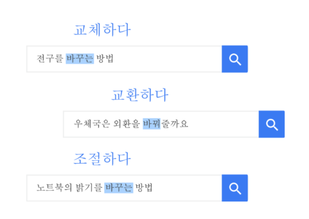

# Google 의 검색

## 검색 알고리즘의 원리

검색을 통해 수십억개의 문서에서 찾아도 그 양도 사용자에게 보이기에는 많다.

그래서 랭킹 시스템을 통해서 찾은 문서를 정렬하는 일이 필요하다.

구글의 랭킹 시스템은 하나가 아닌 여러개의 알고리즘으로 구성되어 있다.

검색 알고리즘은 가장 유용한 정보를 제공하기 위해 검색어의 단어, 페이지 관련성 및 유용성, 출처의 전문성, 사용자의 위치 및 설정과 같은 다양한 요소를 고려해야한다.

각 요소에 적용되는 가중치는 검색어의 성격에 따라서 달라진다. 예를 들면 시사 관련 검색어의 경우에는 사전 정의 검색어보다 최신 콘텐츠인지 여부가 더 중요하다.

검색 알고리즘이 높은 수준의 관련성을 제공해주기 위해서 구글은 [엄격한 절차](https://www.google.com/search/howsearchworks/mission/users/) 를 정립해서 실시간 테스트를 진행하고 전 세계의 숙력된 외부 검색 품질 평가자 수천 명을 동원하고 있다.

이 품질 평가자는 Google 검색 알고리즘의 목표를 명확히 설명하는 엄격한 [가이드라인](https://guidelines.raterhub.com/searchqualityevaluatorguidelines.pdf) 을 따르며, 이 가이드라인은 누구나 확인할 수 있다.

### 단어 분석

관령성이 높은 답변을 제공하기 위해서는 먼저 검색어의 의미를 이해하는 것이 중요하다.

Google 은 색인들에서 어떤 단어 그룹을 찾아봐야 하는지 해석하기 위한 언어 모델을 구축한다.

여기에는 [철자 오류를 해석](https://www.youtube.com/watch?v=J5RZOU6vK4Q&feature=youtu.be&t=2m10s) 하는 것과 같이 간단한 단계가 포함되어 있고, 더 나아가 자연 언어 이해에 관한 몇몇 최근 연구 결과를 적용해서 사용자가 입력한 검색어의 유형을 인식할 수 있도록 하고 있다.

예를 들어 사용자가 검색하는 단어의 정의가 여러 개인 경우에도 Google 의 동의어 시스템을 통해서 Google 검색에서 사용자가 의도하는 단어를 파악할 수 있다.

또한 사용자가 어떤 카테고리의 정보를 찾으려고 하는지 파악하기 위한 노력을 한다.

검색어가 구체적인가, 아니면 광범위한가?

단순 검색 이상의 정보가 필요한가? (웹 문서 이외에 필요한 정보) 를 알려주는 ‘리뷰', ‘사진’, ‘영업시간' 등의 단어가 있는가?

당일 게재된 콘텐츠를 원한다는 것을 암시하는 인기 키워드를 검색하고 있는가?

아니면 주변 업체를 검색하고 있으며 주변 지역의 정보를 찾고 있는가? 등의 사항을 고려한다.

검색어의 카테고리를 지정할 때 특히 검색어에서 최신 콘텐츠를 찾고 있는지 분석하는 것이 중요하다.

인기 급상승 키워드를 검색하면 [최신 알고리즘](https://search.googleblog.com/2011/11/giving-you-fresher-more-recent-search.html) 에서 이 키워드를 오래된 페이지보다 최신 정보가 더 유용하다는 신호로 해석한다.

즉 최신 ‘NFL 점수', ‘댄싱 위드 더 스타' 검색 결과 또는 ‘exxon 수입' 을 검색하면 최신 정보가 표시되어야한다.

### 웹페이지 관련성

검색어를 입력하면 구글은 색인에서 검색어를 검색하여 적절한 페이지를 찾는다. 이떄 알고리즘은 해당 키워드가 페이지 제목이나 본문에서 어떤 위치에 얼마나 자주 표시되는지 분석한다.

키워드와 페이지가 관련성이 있는지를 판단하는 가장 기본적인 방법은 웹페이지에 검색어와 동일한 키워드가 포함되어 있는지를 확인하는 것이다.

검색 알고리즘은 관련성에 관한 신호를 기반으로 웹페이지가 사용자가 찾는 답을 가지고 있는지 평가한다.

예로 사용자가 ‘개' 를 검색했다면 ‘개' 라는 단어가 수백 번 포함된 페이지를 주는게 아니라 개의 사진, 동영상, 또는 품종 목록과 같은 관련 콘텐츠를 포함하고 있는지를 분석한다.

마지막으로 보여줄 페이지가 쿼리에 입련한 언어와 같은 언어로 작성되었는지 확인하고 해당 언어로 된 페이지를 먼저 표시하도록 한다.

Google 은 이렇게 정량적 데이터를 기반으로 관련성을 표현한다. 페이지 콘텐츠의 관점같은 주관적인 개념을 분석하도록 설계되지는 않았다.

### 콘텐츠의 품질

일반적인 검색어의 경우에 관련 정보가 있을 수 있는 웹페이지는 너무나 많다.

이 중에서 가장 유용한 페이지가 가장 먼저 표시될 수 있도록 Google 에서는 웹페이지의 우수성을 평가할 수 있는 알고리즘을 제공한다.

이러한 알고리즘은 콘텐츠의 최신성, 검색어 등장 빈도, 우수한 사용자가 제공했는지 (출처) 의 여부 등 수백 개의 다양한 요인을 분석해서 웹에서 제공할 수 있는 가장 훌륭한 정보를 표시한다.

검색 주제에 대한 신뢰성과 권위성을 평가하기 위해서 Google 은 같은  주제를 다루는 건위 있는 웹사이트에서 나오는 컨텐츠를 더 품질이 우수하다고 표시한다.

웹에는 검색결과 상단에 나오기 위해서 검색어를 반복하거나 PageRank 를 통과하는 링크를 구입하는 등의 방법을 사용하는 스팸 사이트가 많이 있다.

이러한 사이트는 매우 미흡한 사용자 환경을 제공하고 Google 사용자에게 피해를 주거나 사용자를 현혹할 수 있기 때문에 Google 은 스팸을 파악하고 [Google의 웹마스터 가이드라인](https://support.google.com/webmasters/answer/35769?hl=ko) 를 위반하는 사이트를 검색에서 제외하기 위한 알고리즘을 작성한다.

### 웹페이지 활용도

### 문맥 고려하기

구글은 위치나 이전 검색 기록과 같은 정보들을 사용해서 사용자에게 가장 관련성있는 맞춤 검색결과를 제공하도록 한다.

예로 미국 시카고에서 거주하고 있는 사람이 ‘football’ 을 입력하면 Google 은 미식축구와 시카고 베어스 관련 검색결과를 먼저 표시할 것이고, 반면 런던에서 ‘football’ 을 입력하면 Google 은 축구와 프리미어 리그 관련 검색결과를 표시할 것이다.

그리고 최근 사용자가 ‘바르셀로나' 를 검색했고 바로 이전에 ‘바르셀로나 대 아스널' 을 검색한 경우에는 도시가 아닌 축구팀의 정보를 주도록 한다.

또한 Google 은 계정에서의 활동을 기준으로 결과를 맞춤설정하는 일부 기능이 있다. 예를 들어서 ‘주변에서 열리는 이벤트' 를 검색하면 구글은 ‘인종', ’종교', ‘정당' 과 같은 민감한 특성을 기반으로 유추하지 않는다. 사용자가 곤심가질만한 이벤트 카테고리로 일부 추천 검색어를 조정하도록 할 것이다.

## 다양하고 유용한 검색 결과의 형태

래리 페이지는 사용자가 뜻하는 바를 정확하게 이해하고 사용자가 원하는 것을 정확하게 제공할 수 있어야 완벽한 검색엔진이라고 했다.

Google 의 테스트 결과에서는 사람들이 검색에 대한 빠른 결과를 원한다는 점이 계속 일관적으로 나타나고 있다.

그리고 관련성이 높은 답변을 사용자가 원하는 정보 유형의 형태로 계속해서 제공하려고 많은 노력을 해왔다.

사용자가 날씨를 검색할 때는 검색 결과 페이지에 날씨 사이트 링크 뿐 아니라 일기 예보도 바로 표시되도록 했고, ‘샌프란시스코 공항 가는 길' 을 검색할 때는 다른 사이트로 연결되는 링크는 물론, 경로가 표시된 지도가 함께 표시되기를 원했다. 이는 특히 대역폭이 제한되고 사이트 클릭 속도가 느린 휴대기기에서 중요하다.

### 지식 정보

예) 에펠탑은 얼마나 높나요?

Google 은 10억 가지가 넘는 실제 인물, 장소 및 사물, 이러한 항목과 관련된 500억개 이상의 정보 및 관계를 보여주는 Google 데이터베이스인 [지식 그래프를 출시](https://googleblog.blogspot.com/2012/05/introducing-knowledge-graph-things-not.html) 했다.

세상은 텍스트가 아닌 진짜 사물로 되어있어서 구글에서는 사물이 서로 어떻게 연결되어 있는지를 보여주는 지식 그래프를 통해서 사용자는 원하는 답을 얻을 수 있다.

### 길 찾기 및 교통 정보

예) 가로수길까지 가는 길

사용자가 구글에서 ‘가로수길' 과 같은 주소를 찾을 때, 이 거리 이름이 포함된 웹사이트로 가는 링크를 원하지는 않는다 라는 것을 발견했다.

오히려 그 장소가 어디에 있는지, 어떻게 가는지 를 알고 싶어하는 경우가 대부분이었다.

그래서 구글은 클릭 및 드래그해서 쉽게 탐색할 수 있는 지도를 만들었다.

### 직접적인 결과

예) 선댄스 편성표

때떄로 사용자는 특정 검색어에 관한 직접적인 결과를 원한다. 그래서 구글은 사용자가 찾고있는 정보와 서비스를 제공할 수 있으며 자사 콘텐츠에 라이선스를 부여해 검색 결과 페이지에서 바로 유용한 검색 결과를 표시하는 기업들과 협력하고 있다

예를 들어 사용자가 주변 영화관의 영화상영 시간을 알아보고 있는 경우에는 Google 은 사용자 거주 지역의 영화 상영 시간과 관련해서 믿을 수 있는 최신 정보를 보여하고 있는 데이터 제공 업체 및 사용자의 티켓 구매를 도와줄 수 있는 서비스 제공 업체와 협력한다.

### 추천 스니펫

예) 미국 수정헌법 제21조는 언제 통과되었나요?

Google 은 사용자가 질문에 대한 답변을 신속하고 간편하게 찾을 수 있도록 도와주는 것을 목표로한다.

[추천 스니펫](https://support.google.com/webmasters/answer/6229325?hl=ko) 은 Google 의 알고리즘이 질문과 관련 있다고 판단해서 웹사이트에서 프로그래매틱 방식으로 생성한 스니펫에 사용자의 주의를 집중시켜서 이를 통해 질문에 대한 답을 빠르게 찾을 수 있도록 도와준다.

모든 추천 스니펫에는타사 웹사이트에서 인용한 정보의 스니펫 및 타사 페이지 링크, 페이지 제목, URL 이 포함된다.

### 유용한 정보가 많은 목록

예) 유명한 여성 천문학자

어떤 질문에 대한 최고의 답변이 하나만 있는 것은 아니다.

때로는 서로 관련된 사람, 장소, 사물의 목록이나 그룹이 대답이 되기도 한다.

Google 에서는 ‘캘리포니아 등대' 나 ‘유명한 여성 천문학자' 를 검색하면 페이지 상단에 검색한 항목의 목록이 뜨기도 한다.

### 디스커버에서 관심 분야 살펴보기

특정 검색어가 떠오르지 않더라도 가장 관심있는 분야에서 영감을 얻기를 원할 수 있다.

그래서 구글은 디스커버를 만들었다.

Google 앱, Android 홈 화면 및 Google 의 모바일 홈페이지에서 표시되는 디스커버는 관심 분양에 맞게 설정된 컨텐츠를 살펴볼 수 있는 맞춤형 피드다.

특정 주제를 더 많이 또는 더 적게 보고 싶을 때를 표시하고 주제에 따라 경험을 맞춤설정 할 수 있다.

## Google 의 Search Blog

[https://blog.google/products/search/](https://blog.google/products/search/)

## Google 의 Search quality evaluator guidelines

[https://static.googleusercontent.com/media/guidelines.raterhub.com/ko//searchqualityevaluatorguidelines.pdf](https://static.googleusercontent.com/media/guidelines.raterhub.com/ko//searchqualityevaluatorguidelines.pdf)

## Google 검색 센터

[https://developers.google.com/search/docs/beginner/how-search-works](https://developers.google.com/search/docs/beginner/how-search-works)